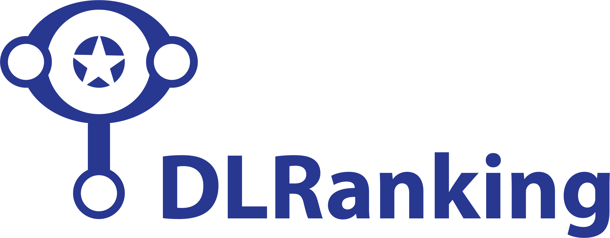
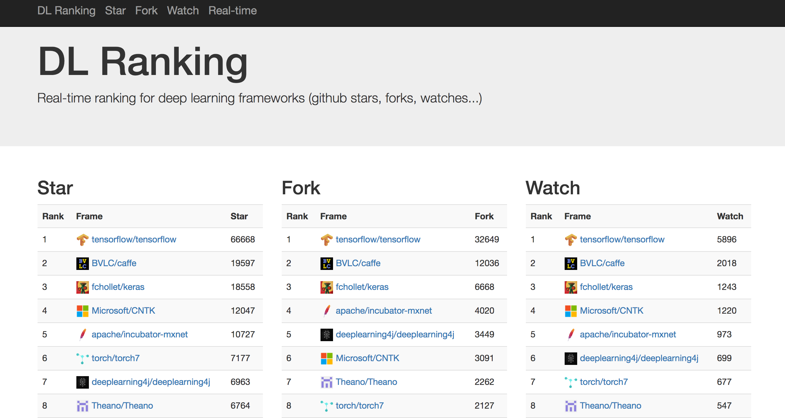
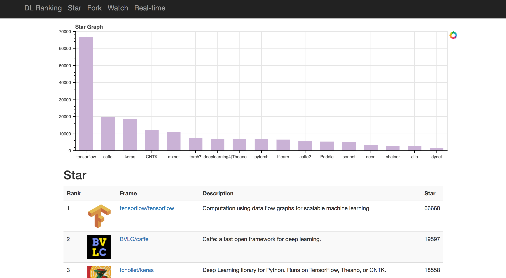

# DLRanking

[DLRanking.com](http://www.dlranking.com/), Real-time ranking for deep learning frameworks (github stars, forks, watches...)

## Structure

Back-end: [Django](https://www.djangoproject.com/), [Bokeh](http://bokeh.pydata.org/en/latest/)

Database: sqlite3

Front-end: [Bootstrap](http://getbootstrap.com/2.3.2/index.html), Javascript

## Webpage

## License

DLRanking is released under the [MIT License](LICENSE).
Please make sure you understand its [implications and guarantees](https://writing.kemitchell.com/2016/09/21/MIT-License-Line-by-Line.html).
